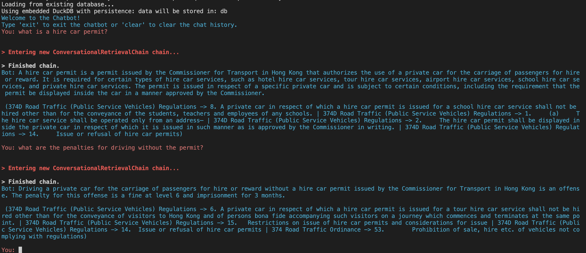

# Langchain Conversational Chatbot

The Langchain Conversational Chatbot is a powerful, interactive tool that leverages OpenAI's GPT-3.5-turbo and GPT-4 language models, as well as the Langchain library, to answer questions based on Hong Kong Ordinances. This chatbot is designed to manage conversation history and provide relevant answers using a combination of the OpenAI API and a database of indexed documents.

## Features

- Utilizes OpenAI's GPT-3.5-turbo and GPT-4 models for generating answers
- Uses Langchain for document retrieval
- Supports Hong Kong Ordinance-specific text splitter
- Handles chat history to maintain context and improve responses
- Limits conversation tokens to 3850 to comply with OpenAI API limitations

## Installation

Clone the repository and install the required dependencies.

```bash
git clone https://github.com/Arrabonae/HKLaw-llm-vector_database.git
cd HKLaw-llm-vector_database
pip install -r requirements.txt
```

## Usage

Run the chatbot by executing the main script.

```bash
python bot.py
```

You will be prompted to enter your OpenAI API key. The chatbot will then start, and you can interact with it by typing your questions. To exit the chatbot, type `exit`. To clear the chat history, type `clear`.

## Configuration

You can configure the chatbot using the following command-line arguments:

- `-v` or `--verbose`: Enable verbose mode (default: `False`)
- `-m` or `--model`: Select the model to use (default: `gpt-3.5-turbo`, options: `gpt-3.5-turbo`, `gpt-4`)
- `-s` or `--use-langchain-splitter`: Use Langchain's own text splitter instead of the default Hong Kong Ordinances splitter (default: `False`)

Example usage with command-line arguments:

```bash
python chatbot.py --verbose --model gpt-3.5-turbo --use-langchain-splitter
```

## Screenshot


## License

This project is licensed under the [MIT License](LICENSE).

## Acknowledgments

This project is built using the following libraries:

- Langchain
- Hugging Face

We appreciate the work done by the developers of these libraries to make this chatbot possible.
